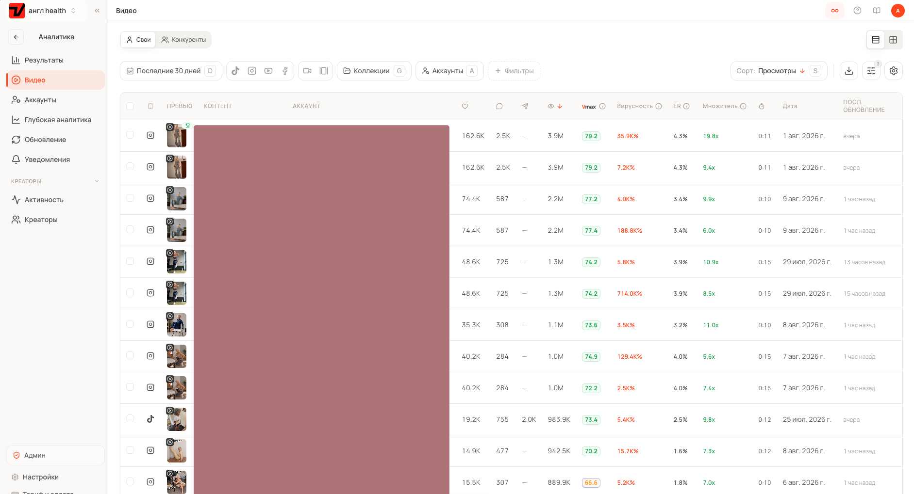

# Как мы разогнали аккаунты до 50 млн просмотров в месяц

*49,7 млн просмотров, 1318 публикаций, 338 тысяч подписчиков за 30 дней. Ниже вся система: аватар, скрипт, продакшн и таблица, по которой мы каждый день решаем, что дожимать и что выключить.*

Сначала о том, кто такие «мы».

Мы делаем [Viralmaxing](https://viralmaxing.com/?utm_source=lesha-site&utm_medium=referral&utm_campaign=blueprint), аналитику для тех, кто растит аккаунты в соцсетях. Параллельно у нас работает агентство. Мы ведём собственные страницы под клиентов тир-1: мобильное приложение и магазин на Amazon. Названий не будет, у нас NDA. Ссылок на страницы тоже, это рабочий актив.

На скрине наша аналитика за последние 30 дней по одной группе аккаунтов. Англоязычная health-ниша, ролики по 10–15 секунд, AI-аватары.

Продукт и агентство делают одни и те же люди. Мы каждый день сидим в этих цифрах сами и упираемся в то, чего в них не хватает, поэтому и собрали свою аналитику.

Дальше вся система по слоям.

Формат виральных видео меняется каждые полгода. Слайдшоу умерли, массовый постинг сотней аккаунтов умер, следующим умрёт что-то ещё. Держится только цикл: сделал, измерил, нашёл причину, повторил с поправкой. Поэтому самый длинный раздел здесь про аналитику.

---

## 1. Зачем нужны эти просмотры

Ролик на три миллиона просмотров, из которого никто не пошёл в приложение и не купил, стоит ноль. Виральность и конверсия конфликтуют, поэтому мы заранее даём каждому ролику роль.

**Продающий.** В кадре есть продукт и внятный переход к действию. За это платит клиент. Такой ролик выходит минимум раз в день.

**На рост.** Без продукта. Он приводит на страницу правильных людей: та же аудитория, что у продукта, но смежная боль, которую продукт не решает.

Страница из одних роликов на рост набирает подписчиков и ничего не приносит. Страница из одних продающих выжигает аудиторию за месяц. Если боль закрывается вашим продуктом, делайте продающий ролик и не хитрите.

---

## 2. Аватар: сначала аудитория, потом персонаж

Многие сначала придумывают колоритного деда, а потом ищут, что бы им продать. Мы начинаем с клиента: читаем отзывы, треды на Reddit и обсуждения, собираем возраст, пол, боли и живые формулировки. Потом спрашиваем, кого эти люди готовы слушать.

Персонажа нужно понимать так же глубоко, как себя. Иначе в кадре получается старушка с вашим темпом речи, вашими реакциями и вашей логикой. Зритель не сформулирует, что с ней не так, и закроет ролик.

Монах, фермер или узкий эксперт получают внимание за счёт необычности. Обычный человек в кадре не получает ничего авансом, и всё вытягивает скрипт. Мы чаще берём второго: он живёт дольше.

Мы не копируем реального человека и его голос, не повторяем чужого аватара один в один и не берём персонажа, который расходится с аудиторией продукта.

---

## 3. Картинка: главное не выглядеть профессионально

Сгенерированный ролик выдаёт себя красотой. Размытый фон, золотой час, ровный свет, поставленная поза. Живое видео снято на телефон в обычной комнате.

**Сначала мастер-картинка.** Один референс персонажа, из которого потом собираются все ролики. Он держит лицо консистентным между видео и заодно становится первым кадром клипа, поэтому его качество задаёт качество всего ролика.

**Промпт против гладкости.** `casual photo, arms at his sides, shot on iPhone, blank background, normal lighting, ultra realistic`. Короткий промпт бьёт длинный. Развёрнутые описания от нейросети ухудшают картинку, это видно за десять генераций.

**Правки через картинку.** Мы подсовываем исходник как ингредиент и просим пересоздать. Дописывание текста в поле съедает качество пикселей.

**Продукт в руке из фотографий покупателей.** Студийное фото с карточки товара блестит и выдаёт рекламу с первого кадра.

На каждый кадр мы генерим по несколько вариантов: результат зависит от удачи не меньше, чем от промпта.

---

## 4. Скрипт: место, где выигрывается всё

Хук вызывает эмоцию и попадает в конкретного человека. Тело держит внимание. Финал вытекает из тела: если тело про одно, а призыв про другое, ролик соберёт просмотры и не соберёт продажи.

Аудитория в скрипте должна быть конкретной, но не узкой. Плохо: «белый мужчина в Ralph Lauren из Денвера на красной Tesla». Хорошо: «замужняя американка 40–50 в менопаузе». У каждой второй есть конкретная боль, и таких людей десятки миллионов.

Вот приёмы, которые мы используем каждый день.

**Хук, ломающий ожидание.** «Самый вредный напиток для почек, и это не алкоголь». Зритель обязан узнать ответ. Мы держим разгадку до последних секунд.

**Незакрытые вопросы.** В сильном хуке их сразу три. Тело открывает новые внутри старых, финал закрывает всё разом. Мозг не переносит неопределённости, на этом всё и держится.

**Стек симптомов.** «Ты устаёшь не потому, что переел, не из-за углеводов и точно не из-за спорта». Зритель чувствует, что его поняли, а вы попутно разбираете ложные причины.

**Стек провалившихся решений.** «Ты пробовал одно, второе, третье, не сработало, потому что...». Снимает с человека вину и закрывает возражение «я уже всё перепробовал».

**Переключение между сегментами.** Внимание держится на смене адресата. То женщине «муж не понимает, что с тобой», то мужчине «легко принять её усталость за лень». Один и тот же ролик заходит сильнее, когда его подаёт неожиданный человек.

У финала четыре правила. Закрыть все открытые вопросы. Объяснить механизм: «содержит вот это, поэтому работает так», а не «даёт энергию». Назвать конкретный продукт вместо общей категории. Показать, как купить или скачать, потому что аудитория 60+ часто теряется на ссылке в профиле.

И главный порядок: сначала решение, потом продукт. Вы объясняете механизм, говорите, что собрать это самому тяжело, и только теперь называете продукт. Начнёте с продукта, и зритель закроет рекламу.

Зритель покупает то, что понял. Разница между конвертящим и неконвертящим роликом чаще в объяснении, чем в самом продукте.

### Разбор реального ролика по битам

Вот скелет ролика из нашей ниши: фитнес для женщин за пятьдесят, аватар в возрасте, длина полминуты.

**Возраст в первой строке.** «Мне 69, и вот неочевидный факт, который изменил мою форму». Возраст даёт авторитет и сразу отсекает чужую аудиторию: ролик для тех, кто узнаёт себя.

**Слом ожидания.** «Долгое изматывающее кардио не нужно». Зритель ждал совета про час на дорожке и остался без своей версии.

**Механизм.** Упражнение включает несколько групп мышц разом, корпус, плечи и ноги, и разгоняет обмен за пять минут в день. Без объяснения это был бы ещё один совет из ленты.

**Конкретика, которую можно повторить сегодня.** Три подхода по двадцать повторений, отдых тридцать секунд.

**Про-совет.** Запястья под плечами, колени вперёд, качество важнее скорости. Здесь зритель понимает, что перед ним человек, который в теме.

**Ключевое слово.** «Напиши ROUTINE в комментариях, и я пришлю свой гайд в личные сообщения». Комментарий запускает автоответ. Страница получает комментарий, диалог и подписку, а зритель получает материал.

**Хэштеги** под нишу и возраст.

Продажа здесь происходит не в кадре, а в личных сообщениях. В самом ролике продукта нет, поэтому площадка видит контент, а не рекламу. И запугивания в нём тоже нет: он держится на любопытстве и на конкретной пользе.

---

## 5. Чем хороший ролик отличается от плохого

Мы сравниваем ролики по трём срезам отдельно. Разом разницу не видно.

**Визуал.** Ошибка номер один у новичков это задранный контраст при низкой экспозиции. Картинка сразу читается как ненастоящая. Мы просим модель поменять цвета или правим в телефоне: экспозицию вверх на три-пять пунктов, контраст вниз. Кадр должен выглядеть так, будто телефон поставили на стол в комнате, без гигантского текстового блока поверх и без съёмки с другого конца помещения. Голос должен звучать как запись с микрофона телефона. Склейки либо незаметны, либо стоят в логичной точке перехода.

**Угол.** Рабочий ролик ведёт зрителя по цепочке: частая проблема, быстрое облегчение, «но это симптом, причина глубже», продукт закрывает причину. Мы даём дофамин и тут же забираем: решение есть, проблема вернётся, потому что корень другой.

**Аудитория.** Ролик с хуком-шуткой собирает всех подряд, и продаж по нему нет даже на миллионе просмотров. Чем дальше хук от категории продукта, тем длиннее путь до продажи, а иногда его нет вовсе. Мы держим хук в одном шаге от продукта.

---

## 6. Ресёрч: откуда берутся углы

Углы собираются из точек, которые вы набили заранее.

**Продукт.** Мы разбираем состав или функциональность: что делает каждый элемент, что подтверждено, что маркетинговый шум. В отзывах лежит живой язык клиента, из которого получаются хуки.

**Обещание.** Карточка товара и ролик обещают одно и то же. Иначе человек придёт, увидит несовпадение и не купит. Мы теряли так целые кампании, пока не начали сверять каждый скрипт с карточкой.

**Аудитория.** Мы собираем таблицу: продукт и оффер, кто клиент, боли, конкуренты, цитаты из лучших отзывов. Отдаём в Claude и просим не «десять хуков», а углы, дырки у конкурентов и подробный портрет с описанием обычного дня.

**Reddit.** Нейросеть даёт направление, Reddit даёт формулировки. Мы ищем по апвоутам и конкретному слову. Много комментариев под болью означает, что боль реальна.

Отдельно мы смотрим на уровень осведомлённости. Одни знают решение, другие знают только проблему, третьи знают проблему и путают решение. Третья группа самая жирная, из неё и растут хуки, ломающие ожидание.

Проверка аудитории простая. Слишком узко, если вы лично не знаете ни одного такого человека. Слишком широко, если под описание попадают все, но покупать не станет никто.

Ресёрч, отданный нейросети целиком, даёт тот же результат, что у любого другого человека с той же кнопкой.

---

## 7. Продакшн: конвейер

Пайплайн: картинки, клипы, голос, монтаж. Ролик собирается из восьмисекундных клипов, каждая картинка становится первым кадром своего клипа. Полутораминутный ролик разбирается примерно на десять клипов и столько же картинок. У нас в топе почти всё по 10–15 секунд, и внутри этой длины кадр меняется три-четыре раза.

Генерация стоит $200 в месяц: безлимит на медленных моделях и 25 000 кредитов сверху. Кредиты уходят быстро, вдвоём этот запас сжигается за пару дней, поэтому черновые прогоны мы делаем на медленных.

Что важно на практике:

- Скрипт бьётся примерно по полторы строки на клип. Меньше текста, и появляются дефекты речи. Больше, и модель тараторит.
- Реплики в промпте мы берём в кавычки, иначе текст всплывает прямо в кадре. Отдельной строкой идёт действие, например «берёт миску, пока говорит».
- Восклицательные и вопросительные знаки ломают речь. Короткую реплику мы удлиняем фразой-заглушкой и потом вырезаем её.
- Лёгкий зум и дрожание камеры убирают ощущение стерильной генерации.

В пост-продакшне три обязательных шага.

**Голос перегенерировать целиком.** Реплики из разных клипов звучат по-разному. Мы достаём дорожку, клонируем голос и генерим всю озвучку одним заходом. Это самая заметная разница между «сделано на коленке» и «сделано».

**Резать мёртвое пространство.** Плюс переходы. Субтитры мы генерим в монтажке, не в видеомодели.

**Водяной знак убирать зумом.** Масштабируем кадр так, чтобы знак уехал за границу, вместо чёрных полос.

Отдельная категория проблем это генерация, которая не слушается. Персонаж поехал или фон сменился: мы не мучаем правками, а делаем новую картинку и подсовываем старую как ингредиент, тогда фон остаётся прежним. Плохой результат при нормальном промпте это обычное дело, поэтому каждый кадр мы генерим в двух-четырёх вариантах.

Перед публикацией мы кладём свой ролик рядом с эталонным и вычищаем очевидные баги до того, как их увидит кто-то ещё. Две-три ревизии на ролик у нас норма.

---

## 8. Аналитика: как это устроено у нас

Мы разбираем каждый залетевший ролик и находим причину. Знакомые креаторы сдувались одинаково: переставали смотреть свои цифры и уходили копировать чужое.

Вот из чего складывается месяц. Мы разложили все 1448 опубликованных роликов по охвату и посчитали, сколько просмотров дала каждая полка.

| Охват ролика | Роликов | Доля всех просмотров |
|---|---|---|
| больше 1 млн | 10 | 40,7% |
| 100K–1M | 67 | 42,0% |
| 10K–100K | 200 | 13,1% |
| меньше 10K | 1130 | 4,2% |

Десять роликов дали сорок процентов месяца. Семьдесят семь роликов дали восемьдесят три. Тысяча сто тридцать роликов из нижней полки принесли четыре процента, и это нормальная цена попыток. Попадание редкое, поэтому нужны две вещи сразу: конвейер, который даёт количество попыток, и таблица, которая ловит попадание в тот же день.

**Ежедневный круг.** Утром мы открываем статистику и смотрим, что выстрелило за сутки, как отработали ключевые слова и где просел ER. На это уходит двадцать минут.

**Рядом 1322 конкурента.** Столько аккаунтов у нас заведено в системе, и лежат они в том же пространстве, что наши собственные, с теми же колонками. Мы видим рынок целиком и ловим сильный залёт в тот же день, а не через неделю, когда угол уже отработали все.

**Момент выброса.** Мы сортируем по множителю: он показывает, во сколько раз ролик обогнал обычный результат своего аккаунта. В верхней строке на скрине 19,8x. За такой цифрой стоит паттерн, который мы дожимаем.

Просмотры годятся для сортировки. Вирусность показывает, что сработал контент, а не накопленная база подписчиков. ER держит нас от погони за пустыми охватами: при одних и тех же 3,9 млн просмотров ER 4,3% и ER 0,4% означают разные вещи, в первом случае ролик зацепил, во втором его пролистали.

**Что происходит дальше.** Мы отдаём выброс креаторам, и из одного винера получается 10–15 роликов: меняем угол, визуал и хук, каркас остаётся. Копировать самих себя один в один бессмысленно, мы итерируем по логике паттерна.

Как это выглядит на практике. Зашла тёрка моркови, значит тестируем тёрку других продуктов. Яблоко собрало 1,9 млн, берём противоположность яблока и снимаем грушу. Сработала печень, идём по остальным органам. Параллельно крутим мелочи: ракурс, цвет миски, лёгкая спорность в кадре. Мы говорим «лимоны», а показываем лаймы, в комментариях начинается спор, и охват растёт на нём.

**Недельный круг.** Раз в неделю мы пересобираем гипотезы: что подтвердилось, что нет, какие сценарии адаптируем под сработавшее.

Ещё две процедуры превращают цифры в решения.

**Сравнение бок о бок, каждый день.** Свой ролик рядом с топовым, и по одному аспекту за просмотр. Этот прогон мы смотрим только скрипт, следующий только движения, третий только голос. Разом всё не видно, по одному находится каждый раз.

**Разбор на кубики.** Каждый кусок ролика работает как сменная деталь: визуал, хук, тело, финал, музыка. Мы меняем строго по одному, иначе непонятно, что сработало. Чужие винеры мы разбираем до каркаса и заливаем туда свой контент. Рабочий хук из другой ниши или с другой платформы часто переносится без изменений: формат «прочитай подпись» мы подсмотрели у книжного блогера и перенесли в health как есть.

**Алгоритм теста.** Пять хуков к одному телу, меняется только хук. Потом лучший хук с новым телом. Потом исходный хук с новым телом. Если не полетело ничего, мы идём дальше и разбираем почему, вместо шестого дубля.

Плюс таблица, которая делает возможными 1318 публикаций в месяц. Рабочие каркасы по горизонтали, рабочие боли по вертикали.

Каркас выглядит так: «еда номер один, которая разрушает твоё тело, и это не мороженое, не бекон и не глютен». Дальше в эту рамку подставляется любая рабочая боль: менопауза, выпадение волос, отёки. Комбинация случайного каркаса со случайной болью почти всегда даёт рабочее видео, а собирается такой ролик за полчаса. В таблице сразу видно, какие клетки уже отработаны, а какие пустые.

---

## 9. Масштабирование

**Не плодите страницы, пока не увидите один работающий формат.** Пока формата нет, десять аккаунтов просто множат один и тот же промах. Сначала одна страница и поиск того, что стреляет.

**Увидели рабочий формат, масштабируйте на всю.** Здесь наоборот, осторожность стоит денег. Формат уходит на все подходящие страницы сразу, потому что окно жизни у него короткое. Вот два кейса из последнего месяца.

**Один ассет, разные страницы.** Ролик с челленджем на пресс собрал 2,5 млн просмотров на странице, которой не было и недели, с парой тысяч подписчиков. Он же на другой, ещё более молодой странице собрал один просмотр. Ассет одинаковый, разница в самой странице и в том, успела ли она пробить траст.

**Один каркас, серия роликов.** Возрастной челлендж дал подряд 3,9 млн, потом 1,3 млн, потом ещё 1,3 млн, потом 889 тысяч и 682 тысячи. Пять попаданий из одной находки.

**Ключевые слова мы включаем не сразу.** Сначала аккаунт должен пробить траст. После этого ключевое слово в ролике запускает автоответ в личные сообщения и заодно тянет подписку, страница начинает расти быстрее. На молодой странице тот же приём привлекает внимание площадки, и мы за это уже платили баном. Подробности в разделе про правила.

**Один рабочий каркас даёт 10–20 роликов.** Особенно если тело не привязано к сезону. Меняются угол, визуал и хук.

**Винеры мы переиспользуем по страницам.** На скрине выше видно строки-двойники: один и тот же ролик опубликован на нескольких аккаунтах, и метрики у него разные, где-то множитель 19,8x, где-то 9,4x. Один и тот же ассет живёт по-разному в зависимости от аудитории страницы, и это тоже данные.

**Одна тема на аккаунт.** Страница строго про одно даёт прайминг. Площадка сама приводит правильных людей, и при тех же просмотрах конверсия выше, чем у солянки.

---

## 10. Правила, которые мы соблюдаем

### Как мы потеряли аккаунт и что теперь делаем всегда

На одной странице мы не поставили метку, что контент сделан нейросетью. Дальше пошли в полную силу: много постов и сразу подключённая автоворонка в директ. Страницу забанили. Разбанить её мы смогли, но урок стоил простоя и нервов.

С тех пор метка «AI-аватар» стоит у нас везде. Она не мешает просмотрам и заметно снижает риск бана: площадка видит, что вы не выдаёте генерацию за съёмку. Прятать ИИ дороже, чем признавать.

Вторая часть того же урока: воронку в директ мы больше не подключаем на молодой странице. Сначала аккаунт должен пробить траст, и только потом появляются ключевые слова и автоответы.

### Остальное

- Никаких обещаний уровня «лечит болезнь». Никаких выдуманных врачей и знаменитостей.
- Метки «реклама» и «AI-аватар» на месте с первого поста.
- Карточку товара на экране мы не показываем. Продукт держим в кадре, площадку называем голосом.
- Мы не гоним всех подряд в профиль формулировками вроде «в магазине подделки, бери только у меня». Это вздувает вашу трекнутую статистику, роняет конверсию карточки, и в сумме денег получается меньше.
- Чужое виральное видео мы не берём за эталон вслепую. Вы не знаете, соблюдает ли оно правила площадки и клиента.

---

## 11. Что бы мы делали с нуля прямо сейчас

**Неделя 1.** Выбираете продукт и аудиторию. Заводите отдельный аккаунт для ресёрча и подписываетесь на всё, что относится к нише, чтобы лента стала источником хуков. Собираете портрет клиента и мастер-картинку аватара.

**Неделя 2.** Первые 10–15 роликов. Скорость цикла тут важнее качества продакшна. Каждый день делаете одно сравнение своего ролика с эталоном.

**Неделя 3.** Подключаете аналитику и начинаете считать. Ищете первый выброс по множителю. Нашли, сразу делаете 10 итераций по логике паттерна, вместо одного осторожного повтора.

**Неделя 4.** Собираете таблицу «каркасы на боли» из того, что сработало. С этого момента вы комбинируете, а не придумываете ролики с нуля.

Чем больше вы публикуете, тем больше у вас данных и тем быстрее вы находите паттерны.

---

## Ежедневная рутина

1. Минимум один продающий ролик: ноль визуальных багов, чистый голос, чистые склейки.
2. Одно сравнение своего видео с эталонным.
3. Ответ на вопрос «почему зашло или не зашло», письменно, одной строкой.
4. План на день вперёд.

## Чеклист продающего ролика

- [ ] Продукт в кадре 5–10 секунд
- [ ] Все открытые вопросы закрыты, механизм объяснён
- [ ] Понятно, что делать дальше и куда идти
- [ ] Нет записи экрана с карточкой товара
- [ ] Метки «реклама» и «AI»

## Чеклист ролика на рост

- [ ] Та же аудитория, что у продукта
- [ ] Смежная боль, которую продукт не решает
- [ ] Даёт ценность сам по себе
- [ ] Этот человек досмотрел бы длинный продающий ролик?

## Инструменты

| Инструмент | Зачем | Заметка |
|---|---|---|
| Google Flow | Картинки и клипы | Nano Banana Pro для кадров, VEO для видео |
| ElevenLabs | Голос аватара | Вся озвучка ролика одним заходом |
| CapCut | Монтаж и субтитры | Субтитры только здесь, не в видеомодели |
| Claude | Ресёрч, углы, скрипты | Дополняет ресёрч, не заменяет его |
| Viralmaxing | Свои аккаунты и конкуренты | Одна таблица, одни колонки, свои и чужие рядом |

Перепродавцов доступа к видеомоделям брать не стоит: это те же API дороже.

---

## Что из этого главное

Приёмы из этого текста устареют. Цикл «сделал, измерил, нашёл причину, повторил с поправкой» останется.

Ресёрч важнее скрипта, скрипт важнее продакшна. Если вы не поняли аудиторию, идеальная генерация соберёт ноль продаж.

Мы дошли до 49,7 млн в месяц, когда перестали угадывать: выброс находится за минуту, разбирается за полчаса и превращается в 10–15 роликов за неделю.

Свои аккаунты и 1322 конкурента мы смотрим в [Viralmaxing](https://viralmaxing.com/?utm_source=lesha-site&utm_medium=referral&utm_campaign=blueprint). Это наш продукт, и он вырос из этой задачи.

Про такие системы мы пишем в телеграме, [заходите](https://t.me/+4XwhB8jbNFJhMmUy).

И последнее. Если знаете крупные проекты в health & fitness в США, бады или мобильные приложения, буду рад познакомиться. С меня 100 000 ₽, если начнём работу. Писать сюда: [@drozdilya_neuro](https://t.me/drozdilya_neuro).
