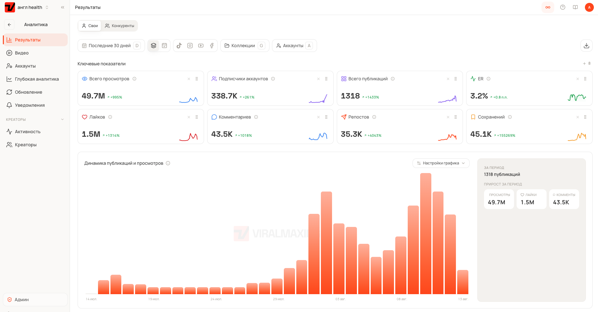

# Как мы разогнали аккаунты до 50 млн просмотров в месяц

*49,7 млн просмотров, 1318 публикаций, 338 тысяч подписчиков за 30 дней. Ниже вся система целиком. Аватар, скрипт, продакшн и таблица, по которой мы каждый день решаем, что дожимать, а что выключить.*

Сначала о том, кто такие «мы».

Мы делаем [Viralmaxing](https://viralmaxing.com/?utm_source=lesha-site&utm_medium=referral&utm_campaign=blueprint), аналитику для тех, кто растит аккаунты в соцсетях. Параллельно у нас работает агентство. Ведём собственные страницы под клиентов тир-1: мобильное приложение и магазин на Amazon. Названий не будет, NDA. Ссылок на страницы тоже, это рабочий актив.

На скрине наша аналитика за последние 30 дней по одной из групп аккаунтов. Англоязычная health-ниша, ролики по 10–15 секунд, AI-аватары.

Продукт и агентство делают одни и те же люди. Мы не собираем аналитику по интервью с пользователями. Мы собираем её потому, что сами каждый день сидим в этих цифрах и упираемся в то, чего не хватает.

Дальше вся система по слоям. Забирайте, взамен ничего не нужно.

Одно предупреждение по жанру. Это не секретный метод. Формат виральных видео меняется каждые полгода. Слайдшоу умерли, массовый постинг сотней аккаунтов умер, следующим умрёт что-то ещё. Выживает не приём, а цикл: сделал, измерил, понял почему, повторил осознанно. Поэтому самый длинный раздел здесь про аналитику, а не про генерацию.

---

## 1. Зачем нужны эти просмотры

Просмотры не результат. Ролик на три миллиона просмотров, из которого никто не пошёл в приложение и не купил, стоит ноль. Виральное и конвертящее разные свойства, и они часто конфликтуют.

Поэтому у каждого ролика в нашем конвейере есть роль.

**Продающий.** В кадре есть продукт и внятный переход к действию. Это то, за что платит клиент. Минимум один такой ролик в день.

**На рост.** Без продукта. Задача привести на страницу правильных людей. Та же аудитория, что у продукта, но смежная боль, которую продукт не решает.

Если делать только ролики на рост, получится большая страница, которая ничего не приносит. Если только продающие, аудитория выгорает и страница глохнет. И если боль решается вашим продуктом, не хитрите, делайте продающий ролик.

---

## 2. Аватар: сначала аудитория, потом персонаж

Типичная ошибка — придумать колоритного деда и пойти искать, что бы им продать. Порядок обратный.

Сначала мы определяем, кто идеальный клиент продукта. Отзывы, треды на Reddit, обсуждения. Возраст, пол, боли, реальные формулировки. Потом реверсим, кого эти люди готовы слушать.

Дальше правило, которое решает всё. Персонажа нужно понимать так же глубоко, как себя. Недоделанный персонаж — это старушка в кадре с вашим темпом речи, вашими реакциями и вашей логикой. Зритель не сформулирует, что не так, но не досмотрит.

Чем нормальнее персонаж, тем сильнее должен быть текст. Монах, фермер, узкий эксперт получают внимание почти бесплатно, за счёт необычности. Обычный человек в кадре не получает ничего авансом, и вытягивать всё приходится скрипту. Мы обычно берём второе, потому что живёт оно дольше.

Чего не делаем никогда. Не копируем реального человека и его голос. Не повторяем чужого аватара один в один. Не делаем персонажа, от которого физически неприятно. Не берём персонажа, который не бьётся с аудиторией продукта.

---

## 3. Картинка: главное не выглядеть профессионально

Признак номер один сгенерированного ролика в том, что он слишком красивый. Размытый фон, золотой час, идеальный свет, поставленная поза. Живое видео снято на телефон в обычной комнате при обычном свете.

Что делаем.

**Сначала мастер-картинка.** Один референс персонажа, из которого потом собираются все ролики. Он даёт консистентность лица между видео и заодно становится первым кадром клипа, поэтому его качество задаёт качество всего ролика.

**Промпт против профессиональности.** `casual photo, arms at his sides, shot on iPhone, blank background, normal lighting, ultra realistic`. Короткий промпт стабильно бьёт длинный. Развёрнутые описания от нейросети картинку ухудшают, это проверяется за десять генераций.

**Правки картинкой, а не текстом.** Подсовываем исходник как ингредиент и просим пересоздать. Дописывание текста в поле съедает качество пикселей.

**Продукт в руке из фотографий покупателей.** Не с карточки товара. Студийное фото блестит и выдаёт рекламу с первого кадра.

И генерим по несколько вариантов на каждый кадр. Плохая генерация чаще вопрос удачи, чем промпта.

---

## 4. Скрипт: место, где выигрывается всё

Структура простая. Хук, тело, переход к действию. Хук вызывает эмоцию, любопытство или надежду или страх, и попадает в конкретного человека. Тело держит внимание. Финал вытекает из тела. Если тело про одно, а призыв про другое, ролик не сработает, каким бы виральным он ни был.

Аудитория в скрипте должна быть конкретной, но не узкой. Плохо: «белый мужчина в Ralph Lauren из Денвера на красной Tesla». Хорошо: «замужняя американка 40–50 в менопаузе». Почти у каждой есть конкретная боль, и таких людей десятки миллионов.

Приёмы, которые мы используем каждый день.

**Хук, ломающий ожидание.** «Самый вредный напиток для почек, и это не алкоголь». Ожидание сломано, мозг обязан узнать ответ. Дальше не раскрываем разгадку до последнего.

**Незакрытые вопросы.** В сильном хуке их сразу три. Тело открывает новые внутри старых, финал закрывает всё разом. Мозг не переносит неопределённости, на этом всё и держится.

**Стек симптомов.** «Ты устаёшь не потому, что переел, не из-за углеводов и точно не из-за спорта». Зритель чувствует, что его поняли, а вы попутно разбираете ложные причины.

**Стек провалившихся решений.** «Ты пробовал одно, второе, третье, не сработало, потому что...». Снимает с человека вину и закрывает возражение «я уже всё перепробовал».

**Переключение между сегментами.** Внимание держится на смене адресата. То женщине «муж не понимает, что с тобой», то мужчине «легко принять её усталость за лень». Один и тот же ролик заходит сильнее, когда его подаёт неожиданный человек.

У финала четыре правила. Закрыть все открытые вопросы. Объяснить механизм, то есть «содержит вот это, поэтому работает так», а не бросить «даёт энергию». Назвать конкретный продукт, а не общую категорию. Показать, как купить или скачать, потому что аудитория 60+ часто буквально не умеет открыть ссылку в профиле.

И главный порядок: сначала решение, потом продукт. Объясняете механизм, говорите, что собрать это самому тяжело, и только теперь называете продукт. Как только начинаете с продукта, ролик становится рекламой, и его закрывают.

Человек не покупает то, чего не понял. Разница между конвертящим и неконвертящим роликом чаще в объяснении, чем в самом продукте.

---

## 5. Ресёрч: откуда берутся углы

Идеи не приходят из воздуха. Они собираются из точек, которые вы набили заранее.

**Продукт.** Разбираем состав или функциональность. Что делает каждый элемент, что подтверждено, что маркетинговый шум. Читаем отзывы, там лежит живой язык клиента, из которого получаются хуки.

**Обещание.** Если карточка товара про одно, нельзя продавать в ролике другое. Человек придёт, увидит несовпадение и не купит. Мы теряли так целые кампании, пока не начали сверять каждый скрипт с карточкой.

**Аудитория.** Собираем таблицу. Продукт и оффер, кто клиент, боли, конкуренты, цитаты из лучших отзывов. Отдаём в Claude и просим не «десять хуков», а углы, дырки у конкурентов и подробный портрет с описанием обычного дня.

**Reddit.** Нейросеть даёт направление, Reddit даёт формулировки. Ищем по апвоутам и конкретному слову. Много комментариев под болью означает, что боль реальна.

Ещё смотрим на уровень осведомлённости. Одни знают решение, другие знают только проблему, третьи знают проблему, но путают решение. Последняя группа самая жирная, из неё и растут хуки, ломающие ожидание.

Проверка аудитории простая. Слишком узко, если вы лично не знаете ни одного такого человека. Слишком широко, если под описание попадают все, но покупать не станет никто.

И типовая ошибка. Отдать ресёрч нейросети целиком. Тогда вы ничем не отличаетесь от любого, кто жмёт ту же кнопку.

---

## 6. Продакшн: конвейер, а не творчество

Пайплайн такой. Картинки, клипы, голос, монтаж. Ролик собирается из восьмисекундных клипов, каждая картинка становится первым кадром своего клипа. У нас в топе почти всё по 10–15 секунд, и внутри этой длины кадр меняется три-четыре раза.

Что важно на практике:

- Скрипт бьётся примерно по полторы строки на клип. Меньше текста, и появляются дефекты речи. Больше, и модель тараторит.
- Реплики в промпте берём в кавычки, иначе текст всплывает прямо в кадре. Отдельной строкой идёт действие, например «берёт миску, пока говорит».
- Восклицательные и вопросительные знаки ломают речь. Короткую реплику удлиняем фразой-заглушкой, которую потом вырезаем.
- Лёгкий зум и дрожание камеры снимают ощущение стерильной генерации.

В пост-продакшне три обязательных вещи.

**Голос перегенерировать целиком.** Реплики из разных клипов звучат по-разному. Достаём дорожку, клонируем голос и генерим всю озвучку одним заходом. Это самая заметная разница между «сделано на коленке» и «сделано».

**Резать мёртвое пространство.** Плюс переходы. Субтитры генерим в монтажке, не в видеомодели.

**Водяной знак убирать зумом.** Масштабируем кадр так, чтобы знак уехал за границу, а не закрываем его полосами.

Перед публикацией сравниваем свой ролик с эталонным, бок о бок. Так вы сами вычищаете очевидные баги до того, как их увидит кто-то ещё. Две-три ревизии на ролик у нас норма.

---

## 7. Аналитика: как это устроено у нас

Всё выше это производство. Дальше начинается то, ради чего написан этот текст.

Виральность не случайна, она объяснима. И ошибка, на которой сдулись почти все, кого мы видели, всегда одна. Человек перестаёт смотреть на собственные цифры и уходит копировать чужое.

**Ежедневный круг.** Открываем статистику. Что выстрелило за сутки, как отработали ключевые слова, где просел ER. Двадцать минут утром.

**Рядом 1322 конкурента.** Столько аккаунтов у нас заведено в системе, и лежат они в том же пространстве, что наши собственные, с теми же колонками. Это принципиально. Не «посмотреть чужие рилсы», а видеть рынок целиком. Сильный залёт виден в тот же день, а не через неделю, когда угол уже отработали все.

**Момент выброса.** Главная колонка это множитель, то есть во сколько раз ролик обогнал обычный результат своего аккаунта. В верхней строке на скрине 19,8x. Это не удачный ролик, это найденный паттерн.

Просмотры сами по себе годятся только для сортировки. Вирусность показывает, что сработал контент, а не накопленная база подписчиков. ER не даёт гнаться за пустыми просмотрами, потому что 3,9 млн при ER 4,3% и 3,9 млн при ER 0,4% это два разных события.

**Что происходит дальше.** Найденный выброс уходит креаторам, и из одного винера мы выжимаем 10–15 роликов. Меняются угол, визуал и хук, каркас остаётся. Копировать самого себя один в один бессмысленно, мы итерируем по логике паттерна. Сработала тёрка моркови, значит тестируем тёрку других вещей, меняем цвет миски, добавляем лёгкую спорность.

**Недельный круг.** Раз в неделю пересобираем гипотезы. Что подтвердилось, что нет, какие сценарии адаптируем под то, что реально сработало.

Ещё две процедуры, без которых цифры не превращаются в решения.

**Сравнение бок о бок, каждый день.** Свой ролик рядом с топовым, и по одному аспекту за просмотр. Этот прогон смотрим только скрипт, этот только движения, этот только голос. Разом всё не видно, по одному находится каждый раз.

**Разбор на кубики.** Каждый кусок ролика это сменная деталь. Визуал, хук, тело, финал, музыка. Меняем строго по одному, иначе не понять, что сработало. Чужие винеры разбираем до каркаса и заливаем туда свой контент. Рабочий хук из другой ниши или с другой платформы часто переносится вообще без изменений.

**Алгоритм теста.** Пять хуков к одному телу, меняется только хук. Потом лучший хук с новым телом. Потом исходный хук с новым телом. Если не полетело ничего, идём дальше и разбираем почему, а не переснимаем шестой раз.

Плюс таблица, которая делает возможными 1318 публикаций в месяц. Рабочие каркасы по горизонтали, рабочие боли по вертикали. Комбинация случайного рабочего каркаса со случайной рабочей болью почти всегда даёт рабочее видео. Сборка такого ролика занимает полчаса.

---

## 8. Масштабирование

Порядок здесь жёсткий, и нарушать его дороже, чем кажется.

**Сначала больше постов на той же странице.** Не плодите аватаров и аккаунты, пока не упрётесь в настоящее узкое место, а оно почти всегда одно, мало идей. Одна страница тянет больше, чем кажется.

**Ключевые слова не сразу.** Мы включаем их, когда аккаунт уже пробил траст. После этого ключевое слово в ролике запускает автоответ в личные сообщения и заодно тянет подписку, страница начинает расти заметно быстрее. На молодом аккаунте тот же приём работает хуже и лишний раз привлекает внимание площадки.

**Один рабочий каркас это 10–20 роликов.** Особенно если тело не привязано к сезону. Меняются угол, визуал и хук.

**Винеры переиспользуем по страницам.** На скрине выше видно строки-двойники. Один и тот же ролик опубликован на нескольких аккаунтах, и метрики у него разные, где-то множитель 19,8x, где-то 9,4x. Один и тот же ассет живёт по-разному в зависимости от аудитории страницы, и это тоже данные.

**Одна тема на аккаунт.** Страница строго про одно даёт прайминг. Площадка сама приводит правильных людей, и при тех же просмотрах конверсия выше, чем у солянки.

---

## 9. Ограничения, которые мы соблюдаем

Скучный раздел, без которого всё остальное однажды обнуляется.

- Никаких обещаний уровня «лечит болезнь». Никаких выдуманных врачей и знаменитостей.
- Метки «реклама» и «AI» на месте.
- Не показываем на экране карточку товара. Продукт держим в кадре, площадку называем голосом.
- Не гоним всех подряд в профиль формулировками вроде «в магазине подделки, бери только у меня». Это вздувает вашу трекнутую статистику, но роняет конверсию карточки, и в сумме денег получается меньше.
- Виральное чужое видео нельзя брать за эталон вслепую. Вы не знаете, соблюдает ли оно правила площадки и клиента.

---

## 10. Что бы мы делали с нуля прямо сейчас

**Неделя 1.** Выбираете продукт и аудиторию. Заводите отдельный аккаунт для ресёрча и подписываетесь на всё, что относится к нише, чтобы лента стала источником хуков. Собираете портрет клиента и мастер-картинку аватара.

**Неделя 2.** Первые 10–15 роликов. Не гонитесь за качеством продакшна, гонитесь за скоростью цикла. Каждый день делаете одно сравнение своего ролика с эталоном.

**Неделя 3.** Подключаете аналитику и начинаете считать, а не чувствовать. Ищете первый выброс по множителю. Нашли, сразу делаете 10 итераций по логике паттерна, а не один осторожный повтор.

**Неделя 4.** Собираете таблицу «каркасы на боли» из того, что сработало. С этого момента вы больше не придумываете ролики с нуля, вы комбинируете.

Дальше система разгоняет себя сама. Больше постов дают больше данных, паттерны находятся быстрее, винеров становится больше, и постов тоже.

---

## Ежедневная рутина

1. Минимум один продающий ролик. Ноль визуальных багов, чистый голос, чистые склейки.
2. Одно сравнение своего видео с эталонным.
3. Ответ на вопрос «почему зашло или не зашло», письменно, одной строкой.
4. План на день вперёд.

## Чеклист продающего ролика

- [ ] Продукт в кадре 5–10 секунд
- [ ] Все открытые вопросы закрыты, механизм объяснён
- [ ] Понятно, что делать дальше и куда идти
- [ ] Нет записи экрана с карточкой товара
- [ ] Метки «реклама» и «AI»

## Чеклист ролика на рост

- [ ] Та же аудитория, что у продукта
- [ ] Смежная боль, которую продукт не решает
- [ ] Даёт ценность сам по себе
- [ ] Этот человек досмотрел бы длинный продающий ролик?

## Инструменты

| Инструмент | Зачем | Заметка |
|---|---|---|
| Google Flow | Картинки и клипы | Nano Banana Pro для кадров, VEO для видео |
| ElevenLabs | Голос аватара | Вся озвучка ролика одним заходом |
| CapCut | Монтаж и субтитры | Субтитры только здесь, не в видеомодели |
| Claude | Ресёрч, углы, скрипты | Дополняет ресёрч, не заменяет его |
| Viralmaxing | Свои аккаунты и конкуренты | Одна таблица, одни колонки, свои и чужие рядом |

Отдельно: не покупайте перепродавцов доступа к видеомоделям, это те же API дороже.

---

## Что из этого главное

Если убрать всё, останется вот что.

**Система, а не приём.** Конкретные приёмы из этого текста устареют. Цикл «сделал, измерил, понял почему, повторил осознанно» не устареет никогда.

**Ресёрч важнее скрипта, скрипт важнее продакшна.** Идеальная генерация поверх непонятой аудитории даёт красивый ноль.

**Расти можно ровно настолько, насколько вы видите свои данные.** 49,7 млн в месяц получились не потому, что мы научились делать более виральные ролики. Мы перестали угадывать. Выброс находится за минуту, разбирается за полчаса и превращается в 10–15 роликов за неделю.

Свои аккаунты и 1322 конкурента мы смотрим в [Viralmaxing](https://viralmaxing.com/?utm_source=lesha-site&utm_medium=referral&utm_campaign=blueprint). Это наш продукт, и он вырос ровно из этой задачи.

Про такие системы мы пишем в телеграме, [заходите](https://t.me/+4XwhB8jbNFJhMmUy).

И последнее. Если знаете крупные проекты в health & fitness в США, бады или мобильные приложения, буду очень рад познакомиться. С меня 100 000 ₽, если начнём работу. Писать сюда: [@drozdilya_neuro](https://t.me/drozdilya_neuro).
