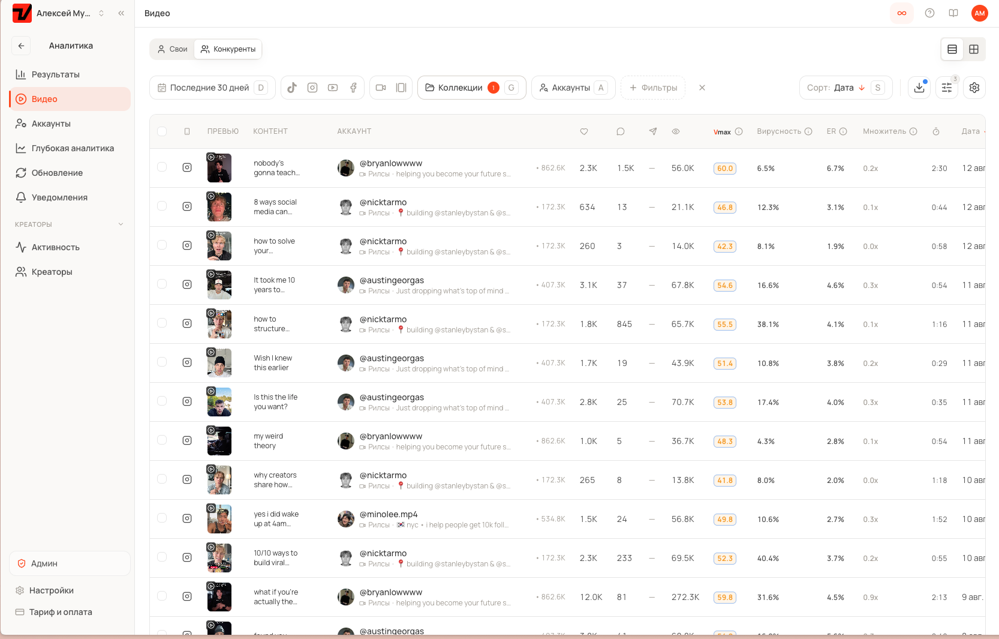
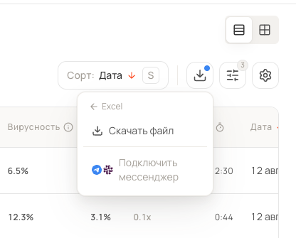
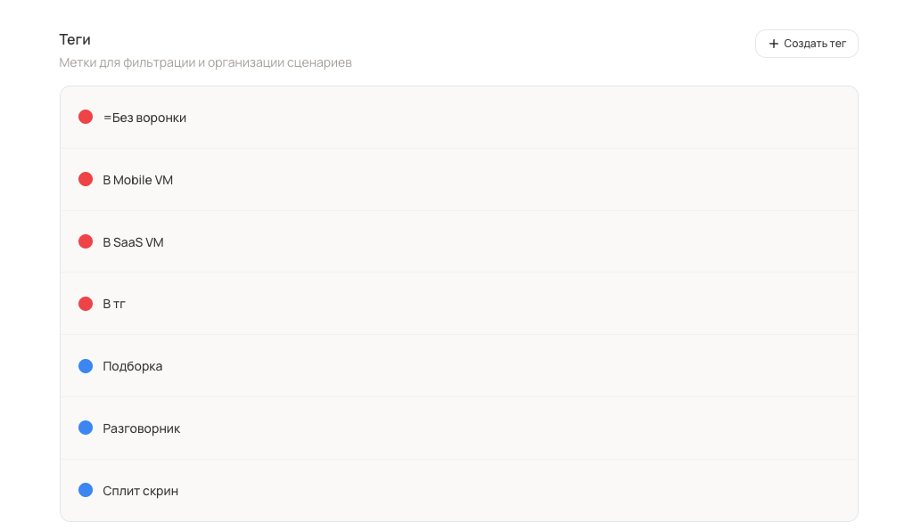
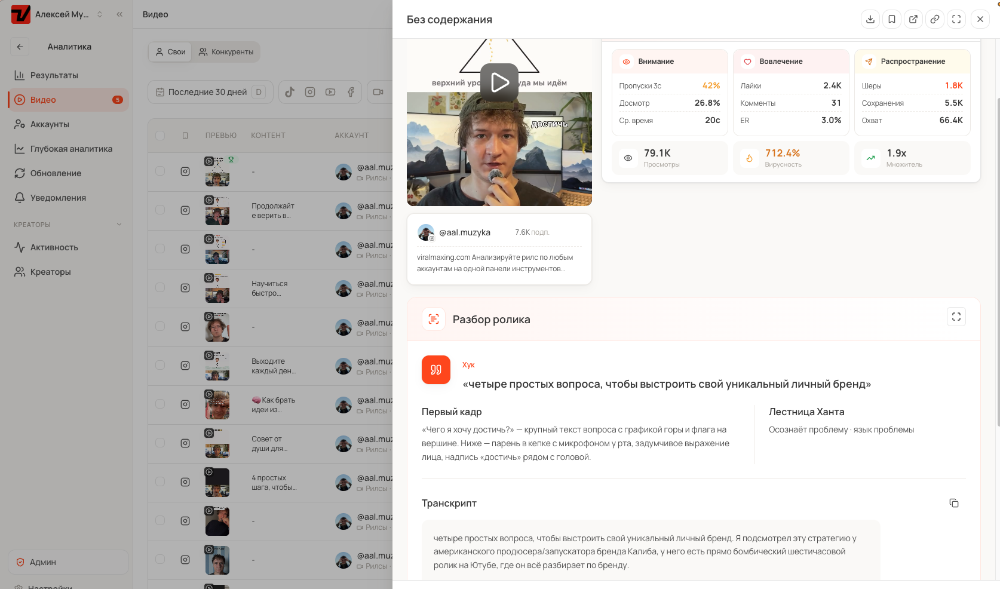
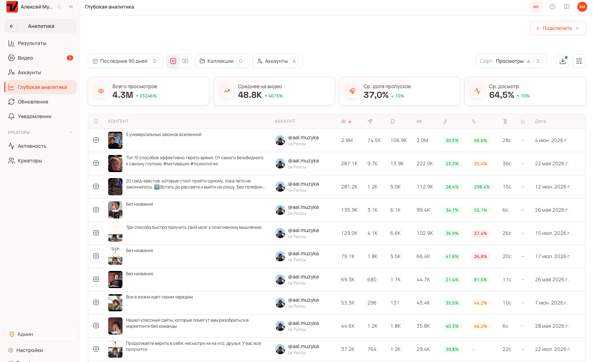
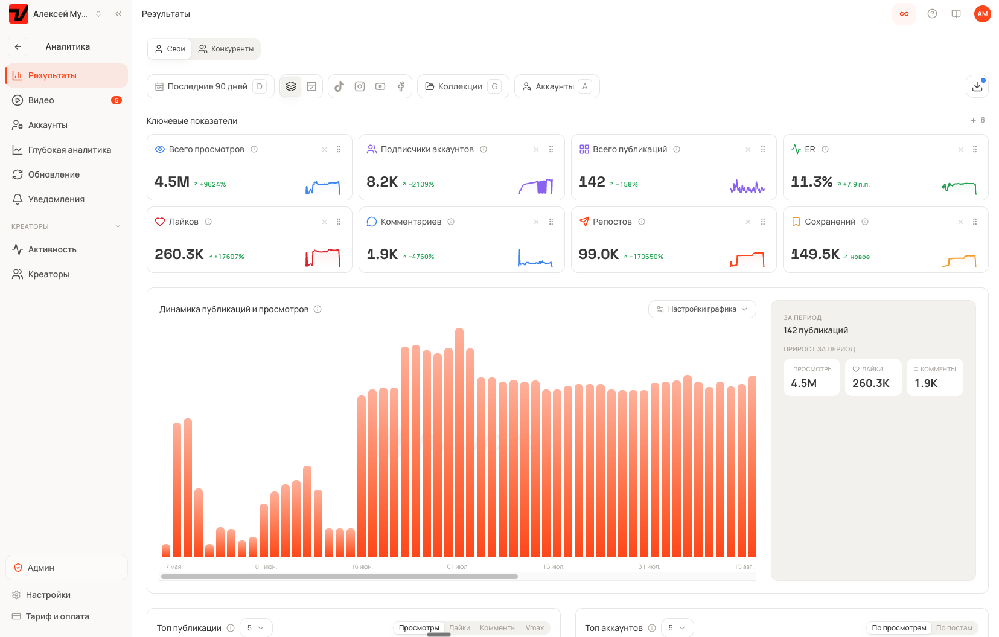

# Метод 6 × 5: тридцать роликов за тридцать минут

*Как собрать контент-план на месяц вперёд из того, что уже сработало в вашей нише, и перестать каждое утро решать, что снимать.*

Утро съёмочного дня выглядит одинаково у всех, кто ведёт аккаунт сам. Камера готова, свет поставлен, а в голове пусто. Дальше человек полчаса листает ленту, находит что-то отдалённо похожее, снимает вялую версию чужого ролика и к вечеру получает четыреста просмотров.

Проблема тут не в лени и не в отсутствии таланта. Придумывание темы с нуля это самая дорогая и самая ненадёжная работа из всех, что есть в контенте. Её можно не делать.

Ниже метод, которым я собираю тридцать сценариев за полчаса. Он работает на любой нише, где есть хотя бы пять живых конкурентов.

---

## Метод в одном абзаце

Берём шесть тем, которые уже приносят просмотры в вашей нише. Берём пять форматов, в которых эти просмотры приходят. Перемножаем.

Шесть тем на пять форматов дают тридцать комбинаций. Каждая комбинация это готовый сценарий: тема отвечает за то, о чём ролик, формат отвечает за то, как он собран. Тридцать сценариев закрывают месяц ежедневных публикаций.

Дальше по шагам.

---

## Шаг 1. Собрать доску конкурентов

Открываем [Viralmaxing](https://viralmaxing.com/?utm_source=lesha-site&utm_medium=referral&utm_campaign=metod-6x5), добавляем свой аккаунт и от пяти до пятнадцати конкурентов. Меньше пяти дают случайную картину, больше пятнадцати превращаются в шум.

Кого добавлять:

**Тех, кто уже растёт на вашей теме.** Не обязательно крупных. У меня на доске есть аккаунт с 54 тысячами подписчиков и средними 17 тысячами просмотров, и рядом аккаунт с 361 тысячей подписчиков и средними 3,4 миллиона. Второй интереснее не размером, а тем, что его ролики стабильно улетают далеко за пределы своей аудитории.

**Тех, кто соседствует по смыслу.** Если вы про продуктивность, берите не только продуктивность, но и деньги, привычки, ИИ. Половина рабочих углов приходит из соседней ниши.

**Одного заведомо большого.** Крупный аккаунт с тысячами роликов нужен как библиотека форматов. Темы у него часто общие, зато упаковка отточена.

Свой аккаунт добавляем обязательно. Без него не с чем сравнивать: собственный средний результат это та планка, относительно которой вы потом будете считать попадания.

Собранная доска выглядит так: одна таблица, где лежат все ролики всех конкурентов за период, с оценкой, вирусностью, ER, множителем и длительностью.



Дальше эту таблицу можно не читать глазами, а выгрузить. Кнопка выгрузки отдаёт Excel-файл, и его удобно закинуть в Claude с просьбой сгруппировать по темам. Там же подключается мессенджер, если выгрузку хочется получать в телеграм.



---

## Шаг 2. Найти шесть тем

Сортируем ролики конкурентов по просмотрам, потом по VM Score. Первая сортировка показывает абсолютные попадания, вторая вытаскивает ролики, которые сработали сильно относительно своего аккаунта.

Дальше главное правило поиска темы:

> Одна залетевшая тема у одного аккаунта это удача. Та же тема, залетевшая у трёх разных аккаунтов, это спрос.

Мы ищем повторяемость. Открываем верхние тридцать роликов доски и выписываем, о чём они. Не формулировки хуков, а именно темы: деньги, внимание, сон, найм, отношения с клиентами.

Выписывать темы руками необязательно. Я вешаю теги прямо на сценарии и ролики, и список тем собирается сам. Теги у меня двух видов, и это важнее, чем кажется.



Красные говорят, куда ведёт ролик: в мобильное приложение, в веб, в телеграм или никуда. Синие говорят, в каком он формате: подборка, разговорник, сплит-скрин. Через месяц я фильтрую по паре тегов и вижу, какой формат доводит людей до какой воронки. Разговорник может собирать больше просмотров, а подборка приводить больше регистраций, и без тегов вы этого не увидите.

Через десять минут в списке остаётся штук пятнадцать тем. Из них выбираем шесть по двум условиям сразу:

1. Тема повторилась минимум у двух-трёх аккаунтов.
2. Вам есть что сказать по ней своего: опыт, цифра, история, несогласие.

Второе условие важнее первого. Тема, по которой у вас нет позиции, превратится в пересказ чужого ролика, и зритель это почувствует.

Например, у меня получился такой набор: внимание, деньги, решения, ИИ, продвижение, личные истории.

---

## Шаг 3. Вытащить пять форматов

Формат это упаковка, в которой тема доезжает до зрителя. Одна и та же мысль в разных форматах собирает разное количество просмотров, и это самая недооценённая часть работы.

Пять форматов, которые повторяются в любой нише:

**Список в кадре.** «Три вещи, которые я перестал делать». Человек говорит, на экране пункты. Работает на сохранения.

**Разбор экрана.** Запись интерфейса с комментарием. Работает на доверие: видно, что вы этим пользуетесь.

**История.** Случай из работы с началом, поворотом и выводом. Работает на досмотр и на подписку.

**До и после.** Показываем состояние, потом результат, потом объясняем переход. Работает на любопытство.

**Короткая инструкция.** «Как сделать за пять минут». Работает на репосты.

Форматы тоже не выдумываем. Открываем те же верхние ролики и смотрим, в какой упаковке пришли просмотры. Определить формат можно за двадцать секунд по первым трём секундам и по монтажу, а можно открыть разбор и прочитать готовый.



Здесь для сетки полезны три вещи. Хук вынесен отдельной строкой, его можно забрать как каркас. Первый кадр описан словами, и по этому описанию свой кадр собирается за минуту. Транскрипт показывает, как автор довёл мысль до конца, и из него видно строение формата.

---

## Шаг 4. Собрать сетку

Дальше механическая часть. Каждую тему соединяем с каждым форматом.

| | Список | Разбор экрана | История | До и после | Инструкция |
|---|---|---|---|---|---|
| **Внимание** | 3 вещи, которые крадут фокус | как я чищу уведомления | день, когда я не открыл телефон до обеда | было 40 переключений, стало 6 | как собрать режим без уведомлений |
| **Деньги** | 5 трат, которые я убрал | таблица расходов на экране | первый месяц без импульсивных покупок | было минус 30%, стало плюс | как посчитать свою цену часа |
| **Решения** | 3 правила выбора | как я веду журнал решений | решение, которое стоило мне года | было наугад, стало по критериям | как принять решение за 10 минут |
| **ИИ** | 5 задач, которые я отдал агенту | агент собирает отчёт на экране | как я перестал писать посты руками | было 2 часа, стало 15 минут | как подключить первого агента |
| **Продвижение** | 3 ошибки в первых роликах | аналитика аккаунта на экране | ролик, который выстрелил случайно | было 400 просмотров, стало 40 тысяч | как найти рабочий формат за неделю |
| **Личное** | 3 привычки, которые держат меня | мой распорядок в приложении | почему я ушёл из найма | было выгорание, стало ритм | как вернуться в режим после срыва |

Тридцать клеток, тридцать роликов.

Два правила заполнения:

**Одна клетка это одна мысль.** Если в клетку просится три идеи, значит вы взяли слишком широкую тему. Разбейте её.

**Пустая клетка это нормально.** Если тема не ложится в формат, оставьте пропуск и не мучайте комбинацию. Двадцать шесть рабочих сценариев лучше тридцати натянутых.

---

## Шаг 5. Сложить в контент-план

Сетка в голове превращается в туман через сутки. Поэтому каждая клетка сразу уходит в контент-план: у меня это план сценариев в Viralmaxing, где у каждого есть статус.

Статусы простые:

- **Бэклог.** Идея записана, к ней ещё не притрагивались.
- **В работе.** Пишется скрипт или снимается.
- **Загружено.** Опубликовано, дальше живёт в аналитике.

Каждый сценарий держит ссылку на ролик-источник, из которого пришла тема или формат. Через две недели вы не вспомните, откуда взялась идея, а ссылка вспомнит.

Дальше раскидываем тридцать сценариев по дням. Утром съёмочного дня вы больше не выбираете тему. Вы открываете следующую клетку, смотрите референс и добавляете к нему свою позицию, свой пример и свои цифры.

---

## Шаг 6. То же самое в чате с Claude

Здесь начинается часть, которую мало кто использует. У Viralmaxing есть MCP-сервер, и это значит, что всю работу выше можно делать не мышкой, а словами в Claude.

Подключается один раз: в настройках Claude добавляется MCP-сервер Viralmaxing, дальше он видит ваши аккаунты, конкурентов, посты и контент-план.

После этого разговор выглядит так:

```
Покажи мои аккаунты и средние просмотры за 30 дней

Выведи топ-30 роликов конкурентов за месяц,
отсортируй по вирусности

Сгруппируй их по темам и покажи, какие темы
повторяются у трёх и более аккаунтов

Возьми в работу ролик #4061316, угол:
разобрать его механику для моей ниши

Покажи мой контент-план, что лежит в бэклоге
```

Что это даёт на практике:

**Группировка тем занимает секунды.** Руками вы читаете тридцать роликов и выписываете темы в блокнот. В чате вы просите сгруппировать и получаете список с частотами.

**Референс сразу превращается в сценарий.** Команда «взять в работу» подтягивает расшифровку ролика и заводит сценарий в плане. Расшифровку не надо запускать отдельно.

**План живёт в одном месте.** Вы спрашиваете, что в бэклоге, и получаете ответ без переключения на другой экран.

Про стоимость. Чтение бесплатно: список аккаунтов, посты, аналитика, контент-план. Энергия тратится на действия: взять ролик в работу стоит единицу, переписать сценарий три, поиск по ключевым словам тридцать, поиск новых конкурентов двести. Перед пачкой действий имеет смысл спросить остаток.

Отдельно про поиск по ключевым словам. Он нужен, когда доски конкурентов не хватает: вы вводите тему и получаете ролики по ней со всего рынка, а не только у тех, кого добавили руками. Для сбора сетки 6 × 5 это способ добрать формат, которого нет ни у кого из ваших конкурентов.

---

## Что происходит дальше каждый день

Сетка снимает вопрос «что снимать», но не отменяет наблюдения.

Десять минут в день уходит на три действия:

1. Посмотреть вчерашний ролик в аналитике и ответить, почему он собрал столько, сколько собрал.
2. Если клетка выстрелила выше обычного, отметить её и запланировать ещё две вариации той же комбинации.
3. Если клетка провалилась дважды, вычеркнуть её и не возвращаться.

Отвечать на вопрос «почему собрал столько» удобнее не по просмотрам, а по двум цифрам: сколько людей смахнули ролик в первые три секунды и сколько досмотрели. Первая цифра судит хук, вторая всё остальное.



Разбор конкретного ролика в примере выше выглядит невесело: 42% смахнули за первые три секунды, досмотрели 26,8%. Хук не сработал, и переснимать надо именно его, а не менять тему. Соседний ролик с долей пропусков 30% и досмотром 56% говорит обратное: каркас рабочий, его надо дожимать.

Через месяц у вас не тридцать случайных роликов, а карта: видно, какие темы работают, какие форматы работают и какие пересечения дают выброс. Следующая сетка собирается уже из своих данных.



Мой аккаунт за 90 дней работы по этой схеме: 142 публикации и 4,5 млн просмотров.

---

## Пять ошибок, на которых это ломается

**Копировать один в один.** Чужой ролик даёт механику, а не содержание. Если убрать свой опыт, останется бледная копия, и алгоритм это видит по досмотрам.

**Брать темы, по которым нечего сказать.** Такая клетка всегда откладывается на потом и в итоге не снимается.

**Менять два кубика сразу.** Поменяли тему и формат одновременно, ролик провалился, и вы не знаете, что было виновато.

**Держать план в голове.** Через три дня половина сетки испарится.

**Собрать сетку и не смотреть аналитику.** Тогда через месяц вы повторите тот же набор ошибок ещё тридцать раз.

---

## Забрать шаблон

Сетка 6 × 5 это обычная таблица: темы по вертикали, форматы по горизонтали, в клетках короткая формулировка ролика. Её можно собрать в любом редакторе таблиц за пять минут, а можно сразу вести сценарии в контент-плане, чтобы к каждой клетке цеплялся источник и статус.

Порядок работы одинаковый в обоих случаях:

- [ ] Пять или больше конкурентов на доске, свой аккаунт добавлен
- [ ] Топ-30 роликов просмотрены, темы выписаны
- [ ] Шесть тем выбраны по повторяемости и по наличию своей позиции
- [ ] Пять форматов вытащены из тех же роликов
- [ ] Сетка заполнена, пустые клетки оставлены пустыми
- [ ] Все клетки лежат в плане со статусами и ссылками на источник
- [ ] В календаре по одному сценарию на день

---

## Что из этого главное

Контент перестаёт зависеть от вдохновения в тот момент, когда вы перестаёте придумывать темы и начинаете их находить.

Метод 6 × 5 занимает полчаса и закрывает месяц публикаций. Дальше ваша работа сводится к тому, чтобы каждый день добавлять к найденной механике своё: позицию, пример и цифру.

Свои аккаунты, конкурентов и контент-план я веду в [Viralmaxing](https://viralmaxing.com/?utm_source=lesha-site&utm_medium=referral&utm_campaign=metod-6x5). Это наш продукт, и он вырос из этой самой задачи.

Про такие системы мы пишем в телеграме, [заходите](https://t.me/+4XwhB8jbNFJhMmUy).

И последнее. Если знаете крупные проекты в health & fitness в США, бады или мобильные приложения, буду рад познакомиться. С меня 100 000 ₽, если начнём работу. Писать сюда: [@drozdilya_neuro](https://t.me/drozdilya_neuro).
